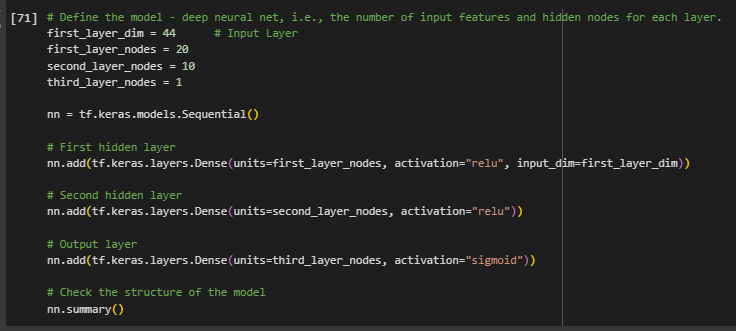
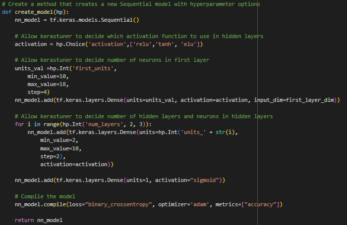
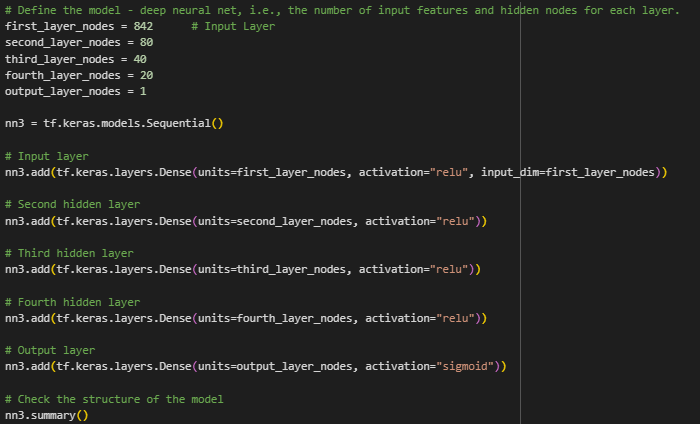

# deep_learning_alphabet_soup

## Introduction

The project is to provide the client, Alphabet Soup, with a model to predict the success of companies they provide funding for. They have provided a CSV containing the metadata for each of the over 34,000 organizations they have funded. 
We apply principles of machine learning specifically to a deep-learning model to be used by Alphabet Soup  

## Summary

In three trials the predictive model was able to exceed the benchmark set for the project. The model has an accuracy, as tested, of 80.2%. 

## Data

[MetaData Site Link](https://static.bc-edx.com/data/dl-1-2/m21/lms/starter/charity_data.csv) 
[Resources Folder Copy of Data](https://github.com/StarkArk/deep_learning_alphabet_soup/tree/main/Resources)

Data Columns:
- EIN: Employer Identification Number, IRS Business Indentifier
- NAME: Organization Name
- APPLICATION_TYPE
- AFFILIATION: Industry Sector
- CLASSIFICATION: Government Organization CLASSIFICATION
- USE_CASE: What the funding will be used for
- ORGANIZATION 
- STATUS: Active Status 
- INCOME_AMT: Income Classification
- SPECIAL_CONSIDERATIONS: Considerations for application.
- ASK_AMT: Funding amount requested
- IS_SUCCESSFUL: Was the money used effectively. "1" -> Yes  
  
## MODELS

### 1st Trial - Simple Model 
  
#### Input: 3 Layers - Input Layer(44 nodes), Deep Layer(10 nodes), and an Output Layer
  

  
#### Output: 
  
**Accuracy: 72.7%    Loss: 55.3%**
  
### 2nd Trial - Optimizing the Model  
  
#### Input: Varied Layers, Nodes, and Activations  
  
  
**Utilizing the Keras_Tuner python library**  
  
  
  
#### Output:   
  
**Accuracy: 73.0%    Loss: 55.2%**  
  
### 3rd Trial - Better and more Optimized  
  
#### Input: Added back a Column of Data -> 'NAME', 5 Layers - Input Layer(842 nodes), 3 Deep Layers(80/40/20 Nodes), Output Layer  
  
  
  
#### Output:  
  
**Accuracy: 80.2%    Loss: 48.3%** 
  
## Discussion  
  
From the initial trial model changing the parameters of the model made little difference to our results. Increasing our accuracy from 72.7% to 73.0%(trial 1 -> trial 2, a mere .3% 
absolute change. After that I added back the 'Name' taken out in the pre-process steps. This added many more features to the data model, from 44-> 842. From this, the prediction 
model obtained the vast majority of its improvement over previous trials. Accuracy now stands at 80.2% as compared to 72.7% in the 1st trial.
  
## Conclusion  
  
The predictive model accuracy is 80.2% with an information loss of 48.3%. This exceeds the benchmark of 75% set for the project.
  

